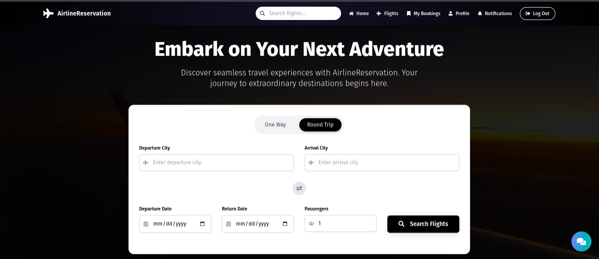
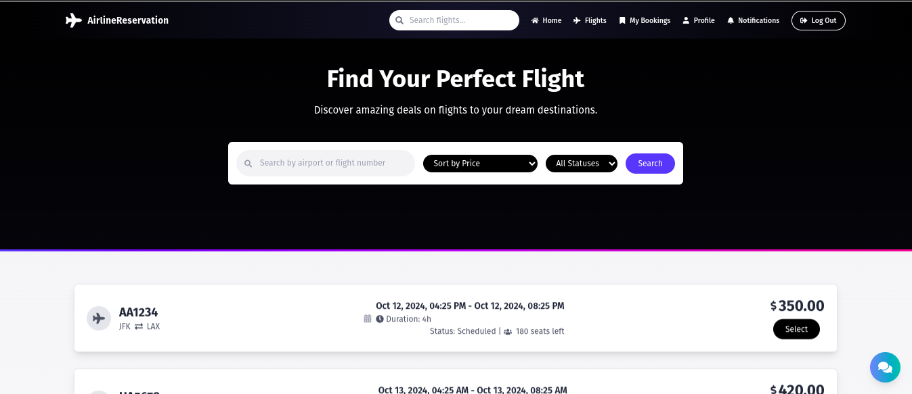
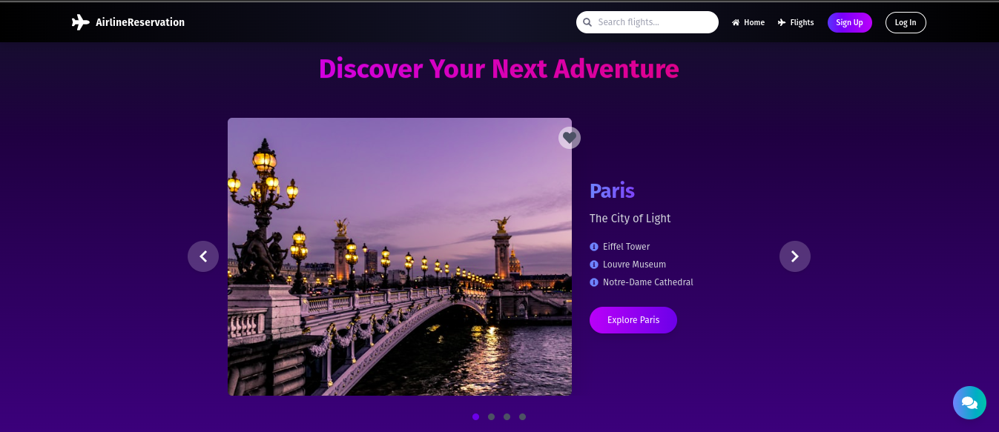
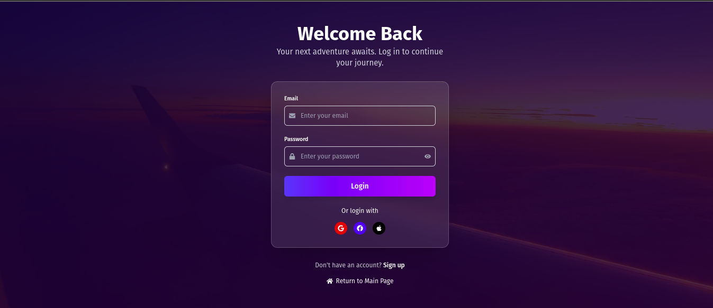

# Airline Reservation System Frontend

This is the frontend application for our Airline Reservation System. It's built using TypeScript and provides a user-friendly interface for customers to search for flights, make bookings, and manage their reservations.

## Features

- User registration and login
- Flight search with various filters
- Booking management
- User profile management
- Responsive design for desktop and mobile devices

## Screenshots

Here are some screenshots of our application:

### Home Page

### Flight Search

### Flight Recommendations

### Login

## Technology Stack

- TypeScript
- React.js
- Styled Components for styling
- Axios for API calls

## Getting Started

To get the frontend running locally:

1. Clone this repository
2. `npm install` to install all required dependencies
3. `npm start` to start the local server (this project uses create-react-app)

The application will be running at `http://localhost:3000`.

## API Integration

This frontend application integrates with our Golang-based backend API. Make sure the backend server is running and the API endpoint is correctly set in the frontend configuration.
